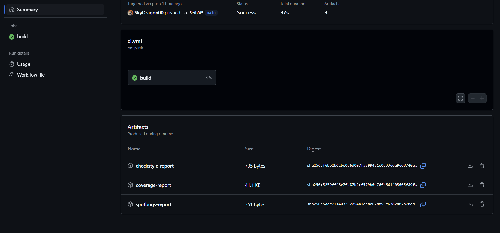

# Discount-Java

Un pequeño proyecto en Java que implementa tres tipos de descuentos, con pruebas unitarias, métricas de cobertura, estilo y análisis estático integrados en un pipeline de GitHub Actions.

<p align="center">
  
</p>

<p align="center">
  
</p>

<p align="center">
  
</p>


## 📋 Descripción

- **Clases funcionales** en `src/main/java/com/example/discount/Discount.java`  
  - `applyDiscount(cost, percent)` – Descuento porcentual  
  - `applyFixedDiscount(cost, discount)` – Descuento fijo  
  - `applyAccumulatedDiscount(cost, percent, fixed)` – Porcentual + fijo  
  - `showFinalPrice(tipo, precio)` – Imprime el resultado en consola  

- **Pruebas** en `src/test/java/com/example/discount/DiscountTest.java` con JUnit 5, cubriendo:
  - Casos “felices”
  - Valores límite
  - Validaciones de errores
  - Salida por consola

- **Métricas & Calidad**  
  - **JaCoCo** → Cobertura de código  
  - **Checkstyle** → Reglas de estilo (Google)  
  - **SpotBugs** → Análisis estático de bugs  

- **CI/CD** via GitHub Actions (`.github/workflows/ci.yml`):
  1. Checkout  
  2. JDK 17  
  3. `mvn clean verify` (compila, prueba, genera JaCoCo, Checkstyle, SpotBugs)  
  4. Sube artefactos:  
     - `coverage-report` (HTML de JaCoCo)  
     - `checkstyle-report` (XML)  
     - `spotbugs-report` (XML)  


## ⚙️ Pre­requisitos

- Java 17 JDK  
- Maven 3.6+  
- GitHub account (para CI)


## 🚀 Instalación y Uso
1. **Clona el repositorio**  
```bash
git clone https://github.com/tu-usuario/Discount-Java.git
cd Discount-Java
```

2. **Compilar y probar**  
```bash
   mvn clean verify
   ```
- Corre tests (JUnit 5)
- Genera informes de JaCoCo, Checkstyle y SpotBugs en target/


## 📐 Estructura de Carpetas
```bash
Discount-Java/
├── .github/
│   └── workflows/ci.yml
├── src/
│   ├── main/java/com/example/discount/Discount.java
│   └── test/java/com/example/discount/DiscountTest.java
├── pom.xml
└── README.md
```


## 🤖 CI/CD con GitHub Actions
El pipeline se dispara en cada push o pull_request a main.
Archivo clave: .github/workflows/ci.yml



Así debería verse tu pipeline al terminar con éxito en GitHub Actions:
**Jobs**
build: corre en ubuntu-latest, hace checkout, configura Java 17, ejecuta mvn clean verify, genera informes y los sube como artefactos.

**Artifacts**
Al abrir la sección Artifacts (en la parte inferior de la página de ejecución), encontrarás tres archivos listados:
```bash
Name                Size      Digest
─────────────────────────────────────────────────────────────────
checkstyle-report   735 Bytes sha256:f6bb2b6cbc0d6d097fa899481c0d336ee96e8740e...
coverage-report     41.1 KB   sha256:5259ff48e7fd87b2cf579b0a76fb661405065f89f...
spotbugs-report     351 Bytes sha256:5dcc711403252054a1ec8c67d895c6382d07a70ed...
```

## 📦 Artefactos
Cuando el workflow termina con éxito encontrarás en Actions → <tu-run> → Artifacts:
- coverage-report → Carpeta ZIP con HTML de JaCoCo
- checkstyle-report → XML con violaciones de estilo
- spotbugs-report → XML con bugs detectados

Cada uno se puede descargar directamente desde esa interfaz.